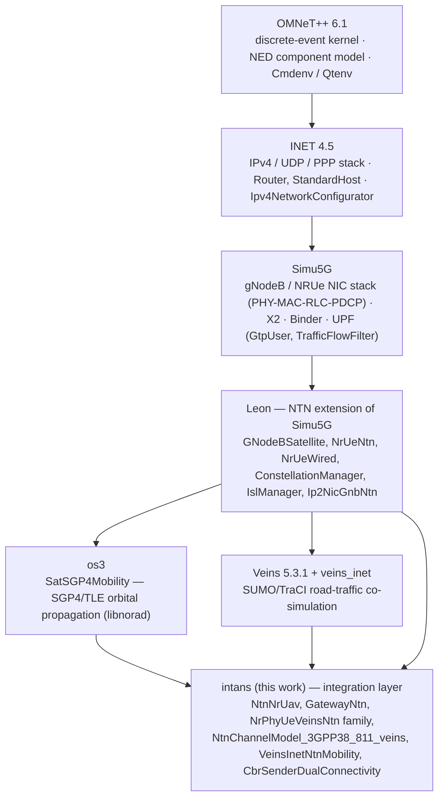
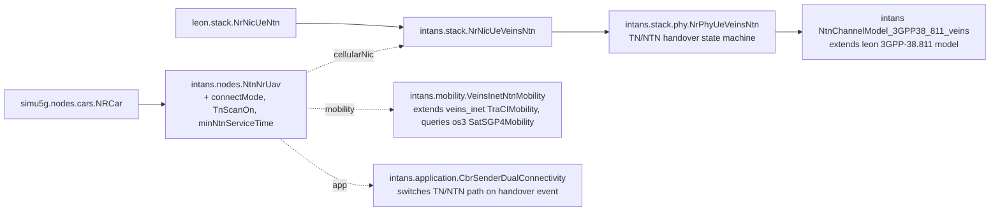
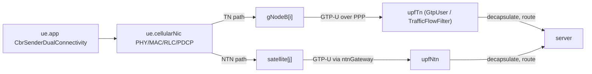
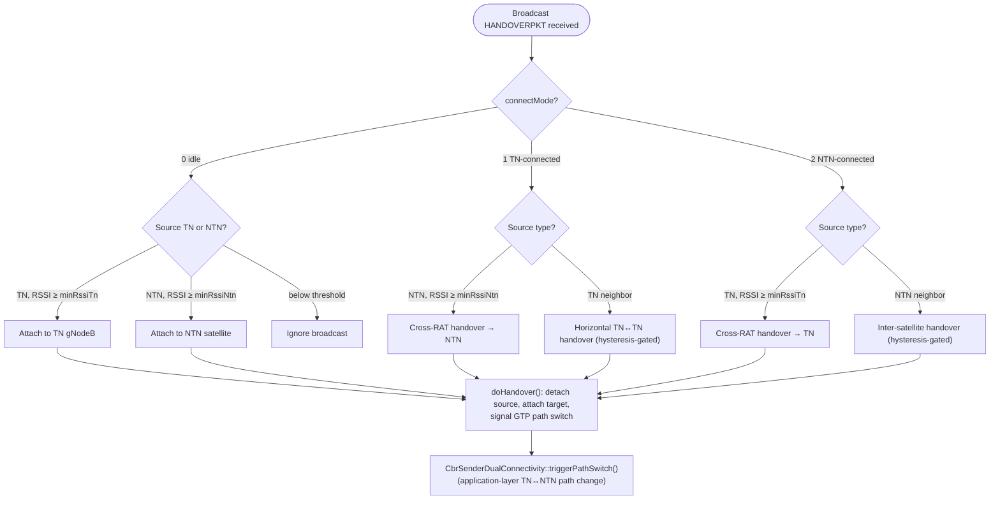
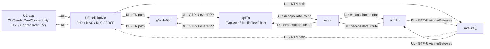

# INTANS simulator 
Published versions 
- VERON
- LEON
- UAV - as User - DRCN
Unpublished version 
- Veins-leon 
- HAP 
- To read - https://ieeexplore.ieee.org/stamp/stamp.jsp?tp=&arnumber=10283628&tag=1

# Paper structure 

- Introduction  (3)
	- NTN networks 6G and use-case verticals 
	- Need for open source simulator 
	- Role of Academia in NTN 
	- Contributions
- Background (3)
	- NTN network Regulation and Standards
	- Mobile usecases - NTN network 
	- NTN Simulators 
- Simulator Design concept (4)
	- Architecture of Userplane and structure 
- Omnet++ and Sumo : General Network Implementation (5)
	-  Used frameworks
	- Protocols and Principals (Theory)
	- Implementation layers - general - Network Architecture and code 
- Use-cases, Results (4)
	- Leon case
	- SIB and Car - Veins Leon 
	- UAV Case
	- HAP case 
- Github repository  -. Guide, Code, Csv dataset for above use-cases
- Potential Expansion of the network , Discussion (1)
	- Implementation ideas and structure
	- Hap Use-case 2
	- MEC
- Conclusion and future work (1)
	- Control Plane 
	- Focus on IP networking 
	- Multi-user scenario 
- References 
	- Writing 20-21 pages 
	- Figures 
		- Intans architecture
		- Simulator figure 
		- Layers, Modules figure and connection 
		- Event analysis 
	- Tables
		- State of art 
		- Network parameters genera
		-  Operational parameters for each simulators 
		- KPI comparision table for each use case
	- Plots  (KPI) - SIB - heuristic, Latency, Throughput , Packet loss Ratio , SINR /RSSI  - vs Time - Uplink and downlink as sub plot
		- Leon - plot 
		- SIB and Car Plot 
		- UAV handover plot 
		- HAP plot 


**First Version Submission Target JUNE 1st** 


# Simulator Discussion Points for Open Source 

- Focus on 4 use-cases  (HAP is not mandatory)
- Run the existing simulator , clean up data - have them with proper structure of data collected 
- KPIs - RSRP, RSSI,SINR , Frame level, Packet level  Latency PLR, Throughput
- Tap into all possible data in analysis - excel in analysis part 
- Physical layer throught (MCS theoritical upper bound) application layer throughput (recieved packets)
- Latency - frame level and E2E
- Check old results and format it


# To do Deadline 

- [x] Introduction -
	- [x] Have a rough sketch - Later revision only 
- [ ] Background 
	- [ ] Building 
- [ ] Theoritical Framework 
	- [ ] Sec c 
---- By Friday ----
- [ ] Simulator tools design   _ Monday
- [ ] Usecases and conclusion / future work  - Wednesday 29th


---
![[NTN_Literature_Review_Organization.md.pdf]]


results of IEEE Access 

# System Design and Simulator Implementation

## 1. Overview

The simulator models a UAV traversing a corridor served by a terrestrial 5G NR radio access network (RAN), with seamless failover to a LEO satellite non-terrestrial network (NTN) segment when terrestrial coverage degrades. It is implemented in OMNeT++ 6.1 as a **layered composition of six independently-maintained frameworks**, with a thin integration layer (`intans`) gluing them together and supplying the NTN-aware handover logic, mobility fusion, and dual-connectivity application behavior that none of the underlying frameworks provide on their own.

## 2. Simulation Framework Stack

Each layer extends the one below it, both in the NED component-inheritance sense and in the build/NEDPATH sense (`opp_makemake --meta:recurse --meta:export-include-path --meta:use-exported-include-paths` propagates include paths and compiled libraries transitively).



**Fig. 1.** Layered framework dependency stack. Each arrow denotes "is extended/depended on by."

**TABLE 1. Framework roles**

| Framework                | Role                                                  | Representative artifacts                                                           |
| ------------------------ | ----------------------------------------------------- | ---------------------------------------------------------------------------------- |
| OMNeT++ 6.1              | Discrete-event simulation kernel, NED component model | `cSimpleModule`, `.ned` compound modules                                           |
| INET 4.5                 | General-purpose wired/wireless networking             | `Ipv4`, `Udp`, `PppInterface`, `Router`, `StandardHost`                            |
| Simu5G                   | 3GPP 5G NR/LTE RAN and core network                   | `gNodeB`, `NRUe`, `Upf`, `GtpUser`, `X2App`, `Binder`                              |
| Leon                     | NTN extension of Simu5G (satellites as gNBs)          | `GNodeBSatellite`, `NrUeNtn`, `ConstellationManager`, `IslManager`, `Ip2NicGnbNtn` |
| os3                      | Orbital mechanics                                     | `SatSGP4Mobility`, `Norad` (libnorad SGP4/TLE propagation)                         |
| Veins 5.3.1 / veins_inet | Microscopic road-traffic mobility via SUMO            | `TraCIScenarioManager`, `VeinsInetManager`, `VeinsInetMobility`                    |
| **intans**               | Integration/glue layer (this work)                    | `NtnNrUav`, `GatewayNtn`, `NrPhyUeVeinsNtn`, `VeinsInetNtnMobility`                |
|                          |                                                       |                                                                                    |

A `patches/` directory in `intans` applies targeted patches to two upstream Simu5G core-network files (`GtpUser.cc`, `TrafficFlowFilter.cc`) to support NTN-aware GTP-U tunnel forwarding toward external (non-UE) data-network destinations — a reproducibility detail worth stating explicitly in the paper, since it means the simulator does not run against unmodified upstream Simu5G.

## 3. Network Topology and Node Composition

The scenario network (`intans.simulations.uavTest.uavTest`) instantiates: one UAV (`uav[0]`), six terrestrial gNodeBs arranged as two X2-connected clusters, an LEO satellite constellation (`satellite[N]`), a ground NTN gateway, two UPFs (`upfTn`, `upfNtn`), and an external `server`. Each node type is a NED composition chain spanning multiple frameworks:

**TABLE 2. Node composition**

| Node                             | Extends                   | Defining package  | Role                                                     |
| -------------------------------- | ------------------------- | ----------------- | -------------------------------------------------------- |
| `uav[0] : NtnNrUav`              | `simu5g.nodes.cars.NRCar` | `intans.nodes`    | UAV UE with dual TN/NTN radio, TraCI-driven ground track |
| `gNodeB[6] : gNodeB`             | `simu5g.nodes.NR.gNodeB`  | `simu5g.nodes.NR` | Terrestrial 5G NR base stations, X2 ring-connected       |
| `satellite[N] : GNodeBSatellite` | `leon.node.GNodeBNtn`     | `leon.node`       | LEO satellite acting as an NTN gNB, SGP4-propagated      |
| `ntnGateway : NrUeWired`         | `simu5g.nodes.NR.NRUe`    | `leon.node`       | Ground gateway bridging NTN radio ↔ wired core           |
| `upfTn`, `upfNtn : Upf`          | Simu5G core               | `simu5g.nodes`    | GTP-U termination, IP routing toward `server`            |
| `server : StandardHost`          | `inet.node.inet`          | `inet`            | External data-network endpoint (traffic sink/source)     |



**Fig. 2.** UAV-side module composition and inheritance chain.

## 4. Control-Plane and User-Plane Data Flow

- **Control plane:** horizontal TN↔TN handovers use Simu5G's X2 interface between neighboring `gNodeB`s; TN↔NTN and NTN↔NTN handovers are coordinated by `intans`'s `NrPhyUeVeinsNtn` (broadcast-triggered) and Leon's `NrHandoverManager`/`IslManager` for inter-satellite bookkeeping.
- **User plane:** uplink/downlink data is GTP-U tunneled from the serving gNB/satellite (via Leon's `Ip2NicGnbNtn` / `GtpUserX2Ntn` for the NTN side) to the appropriate UPF. The UPF's `TrafficFlowFilter` classifies the packet (local BS delivery, inter-BS tunnel, or external network) and `GtpUser` decapsulates/forwards accordingly toward `server`.



**Fig. 3.** Uplink packet path, TN vs. NTN branches.

## 5. TN↔NTN Handover Logic ("Heuristic" Hard-XHO)

`NrPhyUeVeinsNtn` maintains a `connectMode` state (`0`=idle, `1`=TN-connected, `2`=NTN-connected) and drives transitions from RSSI/SINR thresholds (`minRssiTn`, `minRssiNtn`) evaluated against periodic broadcast beacons, independent of the formal 3GPP SIB19/25 signaling path (which remains available as an alternative, more conservative configuration).



**Fig. 4.** TN↔NTN handover decision state machine.

## 6. Mobility and Orbital Propagation

Satellite motion uses os3's `SatSGP4Mobility`, propagating TLE data through the SGP4 model via `libnorad`; `ConstellationManager` (Leon) groups satellites into orbital planes and manages static/dynamic inter-satellite links (ISL). The UAV's ground track is driven by SUMO through `veins_inet`'s TraCI coupling; `intans`'s `VeinsInetNtnMobility` fuses this with the satellite geometry (elevation/distance queries against `SatSGP4Mobility`) so link-budget and handover decisions account for both the UAV's road-network trajectory and the satellites' orbital motion simultaneously.

## 7. Toolchain Notes for Reproducibility

OMNeT++ 6.1, MODE=debug/release dual build; NEDPATH composition follows the layering in Fig. 1, with `--meta:export-include-path`/`--meta:use-exported-include-paths`/`--meta:export-library` propagating headers and libraries across project boundaries; scenario variants are expressed as ini `Config` inheritance (e.g., `CBR-UL`, `CBR-DL`, `CBR-DL-SIB` extending a common `Base`).

---

Want me to also produce a standalone TikZ/PGF version of Fig. 1 or Fig. 4 for direct LaTeX inclusion, or expand any section (e.g., a quantitative parameters table) for the paper?

coarser, threshold-and-state-based rule

Here's Section 5's opening revised with that framing:

## 5. TN↔NTN Handover Logic (Threshold-and-State-Based Rule)

Unlike the formal 3GPP SIB19/25 signaling path — which conditions handover on standardized measurement reporting and elevation/distance-based conditional triggers — the mechanism implemented in `NrPhyUeVeinsNtn` is a **coarser, threshold-and-state-based rule**: a finite `connectMode` state (`0`=idle, `1`=TN-connected, `2`=NTN-connected) transitions purely on whether a beacon's measured RSSI/SINR crosses a fixed threshold (`minRssiTn`, `minRssiNtn`) for the node currently heard, with no prediction, trend estimation, or link-quality forecasting involved. It trades handover optimality for computational simplicity and independence from 3GPP signaling overhead, making it a reasonable baseline against which more sophisticated (e.g., predictive or learning-based) handover policies can be compared.

This framing is also worth carrying into Section 1 (Overview) if you want to set reader expectations early — e.g., "...with failover governed by a coarser, threshold-and-state-based handover rule rather than a predictive or standards-compliant SIB-based procedure." Want me to fold that phrasing into the Overview and Fig. 4's caption too?

provide standalone TikZ/PGF version

Here's a standalone, compilable TikZ/PGF version of Fig. 4 (the handover decision state machine).

```latex
\documentclass[tikz,border=5pt]{standalone}
\usetikzlibrary{shapes.geometric, arrows.meta, positioning}

\begin{document}
\begin{tikzpicture}[
  font=\sffamily\small,
  node distance=10mm and 6mm,
  startstop/.style={rectangle, rounded corners, minimum width=3.4cm, minimum height=0.9cm,
                     text width=3.2cm, text centered, draw=black, thick, fill=gray!10},
  decision/.style={diamond, aspect=2.2, minimum width=2.6cm, minimum height=1cm,
                    text width=2.1cm, text centered, draw=black, thick, fill=blue!6, inner sep=1pt},
  process/.style={rectangle, rounded corners, minimum width=2.9cm, minimum height=0.9cm,
                   text width=2.7cm, text centered, draw=black, thick, fill=teal!8},
  ignoreBox/.style={rectangle, rounded corners, minimum width=2.4cm, minimum height=0.8cm,
                     text width=2.2cm, text centered, draw=black, dashed, fill=gray!5},
  arrow/.style={-{Stealth[length=2.2mm]}, thick}
]

% --- Entry ---
\node (start) [startstop] {Broadcast \texttt{HANDOVERPKT} received};
\node (mode)  [decision, below=of start] {\texttt{connectMode}?};
\draw [arrow] (start) -- (mode);

% --- Branch decision nodes (three columns) ---
\node (idle)  [decision, below left=16mm and 46mm of mode]  {Source TN or NTN?};
\node (src1)  [decision, below=16mm of mode]                 {Source type?};
\node (src2)  [decision, below right=16mm and 46mm of mode]  {Source type?};

\draw [arrow] (mode) -- node[above, sloped, font=\scriptsize]{0: idle} (idle);
\draw [arrow] (mode) -- node[right, font=\scriptsize]{1: TN-connected} (src1);
\draw [arrow] (mode) -- node[above, sloped, font=\scriptsize]{2: NTN-connected} (src2);

% --- Mode 0 (idle) outcomes ---
\node (attachTN)  [process,  below left=10mm and 2mm of idle]  {Attach to TN gNodeB};
\node (attachNTN) [process,  below=10mm of idle]                {Attach to NTN satellite};
\node (ignoreB)    [ignoreBox, below right=10mm and 2mm of idle] {Ignore broadcast};

\draw [arrow] (idle) -- node[left, font=\scriptsize]{TN,\\RSSI $\geq$ \texttt{minRssiTn}} (attachTN);
\draw [arrow] (idle) -- node[right, font=\scriptsize]{NTN,\\RSSI $\geq$ \texttt{minRssiNtn}} (attachNTN);
\draw [arrow] (idle) -- node[right, font=\scriptsize]{below\\threshold} (ignoreB);

% --- Mode 1 (TN-connected) outcomes ---
\node (xho12) [process, below left=10mm and 0mm of src1]  {Cross-RAT handover $\rightarrow$ NTN};
\node (iho1)  [process, below right=10mm and 0mm of src1] {Horizontal TN$\leftrightarrow$TN handover (hysteresis-gated)};

\draw [arrow] (src1) -- node[left, font=\scriptsize]{NTN, RSSI $\geq$ \texttt{minRssiNtn}} (xho12);
\draw [arrow] (src1) -- node[right, font=\scriptsize]{TN neighbor} (iho1);

% --- Mode 2 (NTN-connected) outcomes ---
\node (xho21) [process, below left=10mm and 2mm of src2]  {Cross-RAT handover $\rightarrow$ TN};
\node (iho2)  [process, below right=10mm and 2mm of src2] {Inter-satellite handover (hysteresis-gated)};

\draw [arrow] (src2) -- node[left, font=\scriptsize]{TN, RSSI $\geq$ \texttt{minRssiTn}} (xho21);
\draw [arrow] (src2) -- node[right, font=\scriptsize]{NTN neighbor} (iho2);

% --- Convergence ---
\node (exec)  [startstop, below=22mm of src1, minimum width=8.6cm, text width=8.2cm]
  {\texttt{doHandover()}: detach source, attach target, signal GTP path switch};
\node (appsw) [startstop, below=8mm of exec, minimum width=8.6cm, text width=8.2cm, fill=teal!10]
  {\texttt{CbrSenderDualConnectivity::triggerPathSwitch()}};

\draw [arrow] (attachTN)  -- (exec);
\draw [arrow] (attachNTN) -- (exec);
\draw [arrow] (xho12)     -- (exec);
\draw [arrow] (iho1)      -- (exec);
\draw [arrow] (xho21)     -- (exec);
\draw [arrow] (iho2)      -- (exec);

\draw [arrow] (exec) -- (appsw);

\end{tikzpicture}
\end{document}
```

**To use inside your IEEEtran manuscript** rather than compiling standalone: drop the `\documentclass`/`\begin{document}` wrapper, add to your preamble

```latex
\usepackage{tikz}
\usetikzlibrary{shapes.geometric, arrows.meta, positioning}
```

and wrap the `tikzpicture` in a `figure` environment with `\centering` and a `\caption{TN$\leftrightarrow$NTN handover decision state machine.}\label{fig:handover-fsm}`. Since it's fairly wide, `figure*` (double-column spa



